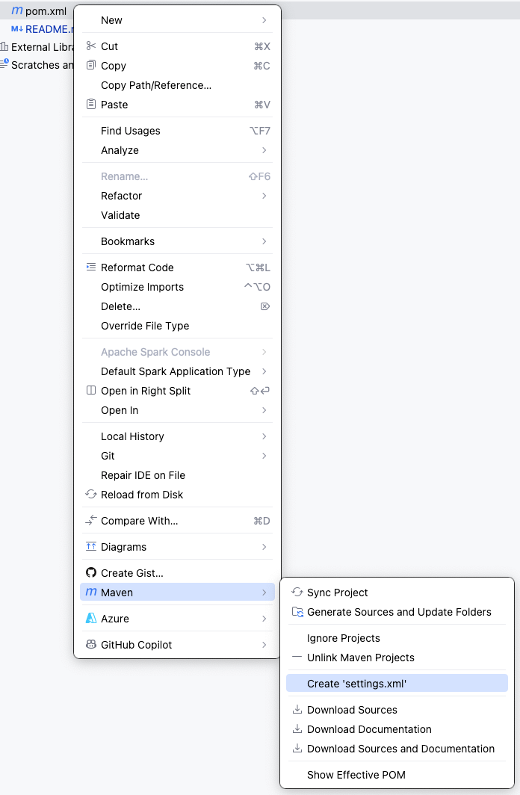

# Advanced Programming Parent POM

## Het idee van een Parent POM in Maven
In Advanced Programming is iedere oefening een afzonderlijk project, dit zijn heel wat projecten. Elk project heeft een pom.xml waarin staat hoe het project gebouwd wordt, welke dependencies het gebruikt, en hoe plugins geconfigureerd zijn.

Als je meerdere projecten hebt die op dezelfde manier gebouwd moeten worden of dezelfde dependencies en plugins gebruiken, kan je **duplicatie vermijden** door een **Parent POM** te gebruiken.

## Wat is een Parent POM?
Een **Parent POM** is een `pom.xml` dat als basis dient voor andere projecten. In de Parent POM definieer je bijvoorbeeld:
- Versies van dependencies
- Plugins en hun configuratie
- Build instellingen
- Properties (zoals Java-versie)

Alle child-projecten die van deze Parent POM **erven** hoeven deze instellingen niet telkens opnieuw te bevatten.

## Waarom gebruiken we een Parent POM?
1. **Centralisatie**: Alles staat op één plek, dus wijzigingen zijn makkelijk door te voeren (door de vakdocenten).
2. **Consistentie**: Alle projecten gebruiken dezelfde versies en instellingen.
3. **Onderhoudbaarheid**: Minder duplicatie betekent minder kans op fouten.

## Advanced Programming Parent POM beschikbaar op GitHub Packages
In ons geval willen we een geavanceerde Parent POM beschikbaar stellen via GitHub Packages. Dit betekent:

1. De Parent POM staat in een GitHub repository.
2. De POM wordt gepubliceerd als een artifact naar [GitHub Packages](https://github.com/orgs/vives-advprog/packages).
3. Andere projecten kunnen deze artifact downloaden en gebruiken als Parent POM.

## In alle Advanced Programming (child) projecten
Je child-project hoeft de Parent POM dus niet zelf te bevatten; Maven haalt hem automatisch op uit GitHub Packages wanneer je het project build.

Het enige wat het child-project moet toevoegen in zijn pom.xml is een verwijzing naar de parent POM:

```xml
<parent>
    <groupId>be.vives.advprog</groupId>
    <artifactId>parent</artifactId>
    <version>1.1.0-SNAPSHOT</version> 
    <relativePath/> 
</parent>
```
En waar het child-project deze parent POM kan vinden:

```xml
<repositories>
    <repository>
        <id>github</id>
        <url>https://maven.pkg.github.com/vives-advprog/vives-advprog-parent</url>
    </repository>
</repositories>
```

Een voorbeeld van zo'n `pom.xml` bestand die verwijst naar de Advanced Programming Parent POM kan je terugvinden in het voorbeeldproject: [pom.xml uit CinemaRoomReservation](https://github.com/vives-advprog/CinemaRoomReservation/blob/main/pom.xml).

---

## TODO als student: **éénmalig** settings.xml configureren

Je hoeft deze parent POM niet zelf aan te passen of ernaar te verwijzen vanaf je eigen projecten.

Maar om hem in je projecten te kunnen gebruiken, moet Maven toegang hebben tot de Packages-repository waar deze POM is opgeslagen.

Daarvoor is een éénmalige je `settings.xml` instellen met je GitHub gebruikersnaam en token.

### Stap 1: Clone
Zorg dat je een project hebt die gebruik maakt van de Parent POM. Bv: [CinemaRoomReservation](https://github.com/vives-advprog/CinemaRoomReservation).

Clone dit project en open het in IntelliJ.

### Stap 2: Create or open `settings.xml`
Klik in IntelliJ rechts op de `pom.xml` file van je project > Maven > Create/Open settings.xml


In de `settings.xml` geef je je GitHub gebruikersnaam en een token op zodat Maven toegang heeft tot de Parent POM op GitHub Packages.

Standaard bevindt het bestand `settings.xml` zich in je Maven-home directory onder `.m2/settings.xml`.

### Stap 3: GitHub credentials toevoegen
Voeg het volgende fragment toe binnen het `<settings>`-element in je `settings.xml`

```xml
<servers>
  <server>
    <id>github</id>
    <username>YOUR_GITHUB_USERNAME</username>
    <password>YOUR_PERSONAL_ACCESS_TOKEN</password>
  </server>
</servers>
```

Vervang `YOUR_GITHUB_USERNAME` met jouw GitHub username.

Vervang `YOUR_PERSONAL_ACCESS_TOKEN` door een token dat je hebt aangemaakt op GitHub:
- Ga naar https://github.com/settings/tokens
- Klik rechts boven op Generate a new token > **Generate a new token (classic)**
- Maak een **Personal Access Token (classic)** aan met minstens de **read:packages-scope**.
- Expiration: vandaag + 1 jaar
- Kopieer het token en gebruik het als `<password>` in je `settings.xml`

⚠️ Houd je token geheim — commit het niet naar GitHub en deel het niet met anderen.

### Stap 4: Verifieer
- Build het project via Maven Clean Package
- Je krijgt een **BUILD SUCCESS** als alles correct ingesteld is
